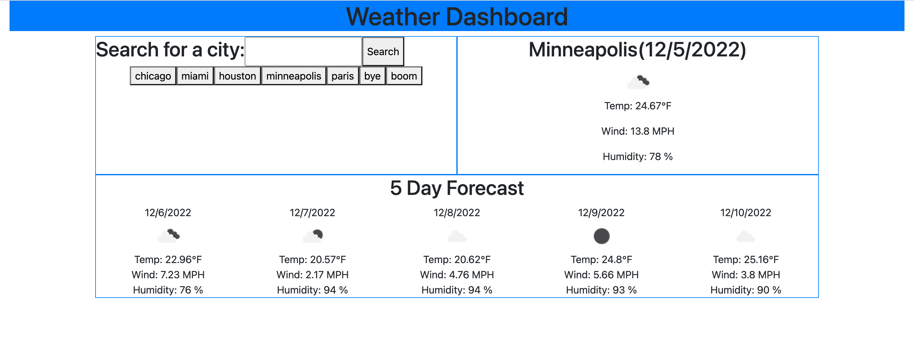
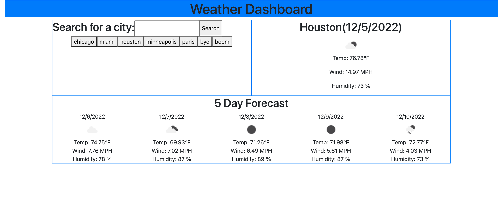

# <Weather-Dashboard>

## Description

My motivation for this project was to build an application to allow the user to see the current weather as well as the 5-day forecast based on a city search. I gained experience retrieving information from web API's as well as experience using local storage.

## Usage

To use this application, simply enter a city in the search bar and click the search button. To search for a city already in your search history, you may click on the button containing that city underneath the search bar.

## License

MIT License 

## Deployed Link

https://salenaoneill.github.io/weather-dashboard/
